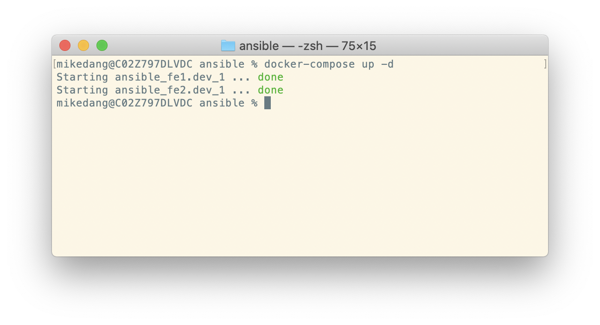

#  Ansible

### Learning Objectives

- Explain the benefits of configuration management and infrastructure as code 
- Describe how Ansible works conceptually
- Differentiate between tasks and roles
- Write a playbook that is capable of setting up two Nginx web servers and a Flask API 
- Explain what happens when you run an Ansible playbook 

## Lesson Overview

| Topic                | Type     | Timing |
| -------------------- | -------- | ------ |
| What is Ansible and How Does it Work? | Lecture | 15 min |
| Setting up Docker | Code Along | 10 min |
| Configuring Ansible | Code Along | 10 min |
| Creating our Playbook | Code Along | 10 min |
| Adding a REST API with Python Flask | Exercise | 15 min | 


## What is Ansible?

- What is configuration management/infrastructure as code? 
- Benefits of IaC
- What are similar tools/services (Chef, Puppet, Terraform)
- Written in Python

### How's it work?

- One control machine that has Ansible installed
- Ansibe is agentless, it's not a requirement for the target hosts that are created by the control machine 
- Ansible connects through SSH to target hosts

### Tasks

- Tasks define the operation to perform to the target host (e.g. installing a package, copying files to the host destination, etc.)
- Roles are a collection of tasks for when you want to run a set of tasks across multiple playbooks

### Playbooks

- YAML based 
- Instructs Ansible what to do through tasks (e.g. install/update software, copy files, start/stop services) and to which groups of target hosts (single machine, front-end servers, application servers, database servers, etc)
- Able to specify which groups a set of tasks will affect 

### Inventory

- Also known as a hosts file, it’s an INI configuration file containing a list of groups and target hosts that Ansible will work with while running playbooks

## Installing Ansible 

[Ubuntu Playground](https://www.katacoda.com/courses/ubuntu/playground)

MacOSX
```
$ sudo easy_install pip
$ sudo pip install ansible
```

Test the installation 

```
$ ansible --version
```

## Setting up our Nginx Web Servers

In this demo, we'll set up two front-end web servers running Nginx using Docker containers. In case you aren't familiar, Nginx is a free, open-source and high-performance HTTP server that's popular for serving static websites. Docker isn't a requirement for running Ansible, however for demo purposes it allows us to understand the power of Ansible without having to provision separate physical or virtual machines right now. 

### Clone this repository 

To get started, clone this repository and `cd` into the `starter` folder to follow the code along. 

### Enable SSH access

In order for Ansible to be able to SSH into our containers we'll set up some SSH keys for our application. The following command will generate both the public (ansible_rsa.pub) and private part (ansible_rsa) of the key. 

```
$ ssh-keygen
```
**Note** When prompted to enter the filename use `./ansible_rsa` to avoid overwriting any existing SSH keys you might already have set up. You can also leave the passphrase empty when prompted as this is only for demo purposes.

### Creating our Dockerfile 

We'll use an Ubuntu container as the basis for our image, remember a requirement of Ansible is Python, so we'll also want to install that and enable SSH as well. This will also allow us to SSH directly into our containers for debugging purposes as needed. 

```Dockerfile
# Dockerfile
FROM ubuntu:latest
RUN apt-get update && \
    apt-get install -y openssh-server pwgen netcat net-tools curl wget && \
    apt-get clean all

RUN apt-get update && apt-get install -y \ 
        build-essential \ 
        python3 \ 
        python-dev \ 
        libxml2-dev \ 
        libxslt-dev \ 
        libssl-dev \ 
        zlib1g-dev \ 
        libyaml-dev \ 
        libffi-dev \ 
        python3-pip

RUN pip install --upgrade pip \ 
 virtualenv \
 requests

# Enable SSH access
RUN mkdir /var/run/sshd

RUN sed -ri 's/^PermitRootLogin\s+.*/PermitRootLogin yes/' /etc/ssh/sshd_config
RUN sed -ri 's/UsePAM yes/#UsePAM yes/g' /etc/ssh/sshd_config

RUN mkdir /root/.ssh
COPY ./ansible_rsa.pub /root/.ssh/authorized_keys
RUN chmod 400 /root/.ssh/authorized_keys

# Port 22 for SSH and 5000 for Flask
EXPOSE 22 5000
CMD ["/usr/sbin/sshd", "-D"]
```
 
Now build the Docker image and tag it as `ubuntu-ansible` for use later. 
```
$ docker build . -t ubuntu-ansible
```

### Creating the compose file 

We'll use the `ubuntu-ansible` image we created in the previous step as the base for our front-end web servers. We'll create two servers in this example but it could easily be expaded to include more. 

```Dockerfile
# docker-compose.yml
version: '2'
services:
  fe1.dev:
    image: ubuntu-ansible
    hostname: fe1.dev
    ports:
      - "2224:22"
      - "8081:80"
  fe2.dev:
    image: ubuntu-ansible
    hostname: fe2.dev
    ports:
      - "2225:22"
      - "8082:80"
```

Now let's initialize our Docker containers: 

```
$ docker-compose up -d
```



If you open Docker Desktop, you should see the following two containers running. 


## Setting up Ansible

### Inventory file

The inventory file lets Ansible know what target hosts are available and segments them into logical groups for running specific tasks. 

```inventory
# inventory
[frontend]
fe1.dev
fe2.dev
```

### ssh.config

The ssh.config file helps us from having to remember all the remote IP addresses, usernames, ports, etc for all the remote machines we need to connect to. If not present in the current directory, Ansible will use the global ssh configuration on your machine. 

```
# ssh.config
Host *
    # Disable host key checking: avoid asking for the keyprint authenticity
    StrictHostKeyChecking no
    UserKnownHostsFile /dev/null
    # Enable hashing known_host file
    HashKnownHosts yes
    # IdentityFile allows to specify exactly which private key to use for authentication
    IdentityFile ./ansible_rsa

Host fe1.dev
    HostName localhost
    User root
    Port 2224
Host fe2.dev
    HostName localhost
    User root
    Port 2225
```

### ansible.cfg

The configuration file can be used to define a different location for your inventory file or to pass special SSH parameters. Ansible will look for this file in the current directory, or in your home directory (named **.ansible.cfg**) and finally in **/etc/ansible/ansible.cfg**.

```
# ansible.cfg
[defaults]
# Default location of the inventory file that Ansible will use to determine what hosts it can talk to
inventory = inventory

# Specify here the remote hosts so we do not need to configure them in main ssh config
[ssh_connection]
transport = ssh
ssh_args = -F ssh.config
```

### Test the configuration 

Test that the servers can be reached with the following command in the terminal: 
```
$ ansible all -m ping
```

You should get a response similar to the following: 
```
fe1.dev | SUCCESS => {
    "changed": false, 
    "ping": "pong"
}
fe2.dev | SUCCESS => {
    "changed": false, 
    "ping": "pong"
}
```

## Creating the Ansible Playbook 

Let's create a new file named **site.yml** that will be the playbook we'll use to install Nginx, copy the starter code over and finally start the Nginx server itself. 

```
# site.yml 
- hosts: frontend
  remote_user: root
  become: yes

  tasks:
    - name: install the latest version of Nginx
      apt: name=nginx state=latest
    - name: copy the HTML page to the server
      template:
        src: ./frontend/index.html
        dest: /var/www/html/index.html
    - name: start nginx
      service:
        name: nginx
        state: started
```

### Run the playbook 

Now let's run the following command to execute the playbook: 

```
$ ansible-playbook site.yml
```


### Confirming the changes 

Go back to Docker Desktop and hover over one of the front-end servers. Click on the second button for the CLI. 


Within the interactive shell that just opened, `cd` into the destination directory specified in our playbook: `/var/www/html`. We should see the **index.html** file copied over for this and the other front-end server if we were to check there also. 

```
$ cd /var/www/html/
$ ls
$ cat index.html
```

Now if you remember in our Docker compose file, we mapped the ports from our containers to our local machine, specifically ports `8081` and `8082`. 

Let's access these URLs in our local web browser, you should see we now have two websites served by Nginx! 


How cool is that??

## You Do: Add a Back-End Flask API 

With a few updates, we will be able to add a Python REST API using Flask! 

Update **docker-compose.yml** to include the Flask API server. Flask runs by default on port 5000, we'll map that port on the container to port `8083` on our machine. We can use the same base image from before since it already has Python installed. 

```Docker
version: '2'
services:
  fe1.dev:
    image: ubuntu-ansible
    hostname: fe1.dev
    ports:
      - "2224:22"
      - "8081:80"
  fe2.dev:
    image: ubuntu-ansible
    hostname: fe2.dev
    ports:
      - "2225:22"
      - "8082:80"
  be1.dev:
    image: ubuntu-ansible
    hostname: be1.dev
    ports:
      - "2226:22"
      - "8083:5000"
```

Now run the compose file to bring up our back-end container. 
```
$ docker-compose up -d
```

Update the **inventory** file to include a new group for backend servers. 

```
[frontend]
fe1.dev
fe2.dev

[frontend:vars]
ansible_python_interpreter=/usr/bin/python3

[backend]
be1.dev

[backend:vars]
ansible_python_interpreter=/usr/bin/python3
```

Update the **ssh.config** file 

```
Host *
    # Disable host key checking: avoid asking for the keyprint authenticity
    StrictHostKeyChecking no
    UserKnownHostsFile /dev/null
    # Enable hashing known_host file
    HashKnownHosts yes
    # IdentityFile allows us to specify exactly which private key to use for authentication
    IdentityFile ./ansible_rsa

Host fe1.dev
    HostName localhost
    User root
    Port 2224
Host fe2.dev
    HostName localhost
    User root
    Port 2225
Host be1.dev
    HostName localhost
    User root
    Port 2226
```

Modify the Ansible playbook to include tasks for installing Flask on the backend server and copying a different HTML file in the starter folder that makes an AJAX request. 

```
- hosts: frontend
  remote_user: root
  become: yes

  tasks:
    - name: install the latest version of Nginx
      apt: name=nginx state=latest
    - name: copy the HTML page to the server
      template:
        # This time let's pull the HTML file containing an Ajax call to http://localhost:8083
        src: ./frontend/ajax.html
        dest: /var/www/html/index.html
    - name: start nginx
      service:
        name: nginx
        state: started

- hosts: backend
  remote_user: root
  become: yes

  tasks:
    - name: install Flask
      pip: name=flask
    - name: install flask_cors
      become: true
      pip:
        name: flask_cors
        state: present
    - name: copy the app to new server 
      template:
        src: ./backend/app.py
        dest: /var/opt/app.py
    - name: start Flask
      shell: "FLASK_APP=/var/opt/app.py flask run --host=0.0.0.0"
```

Run the playbook again. 

```
$ ansible-playbook site.yml
```

Finally, let's test our websites again to make sure they're now pulling data from our Flask API (http://localhost:8083/courses) by going to:

- http://localhost:8081
- http://localhost:8082


Fin
