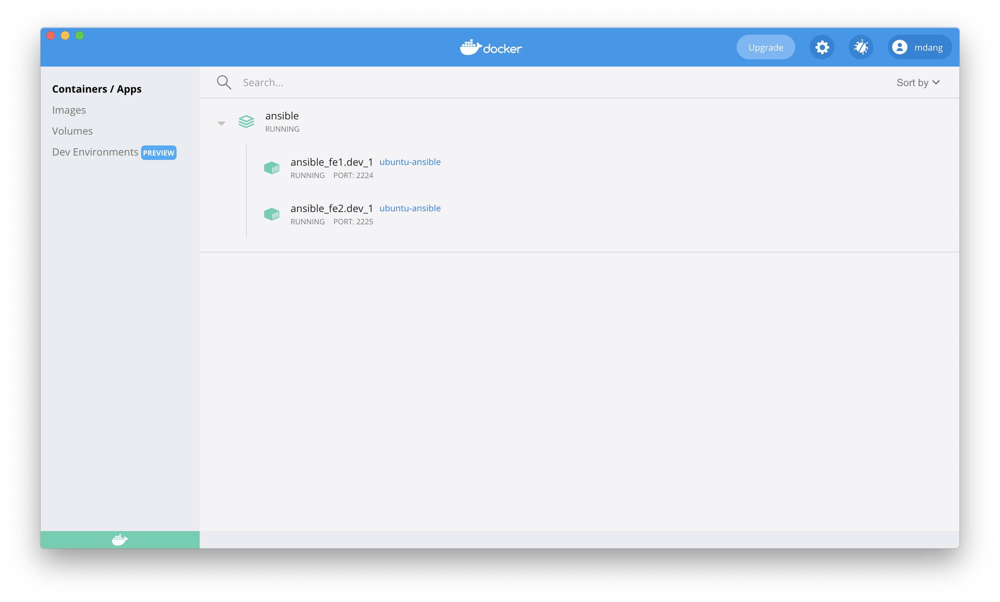
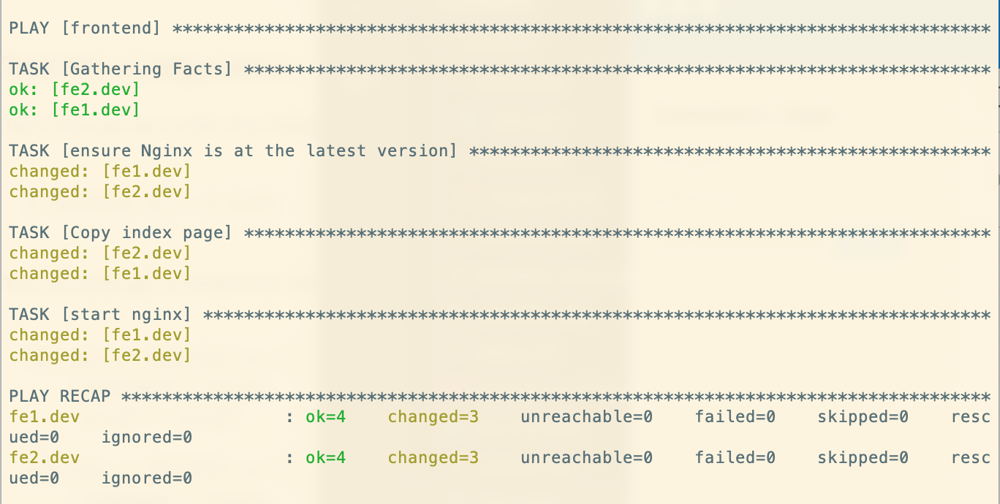
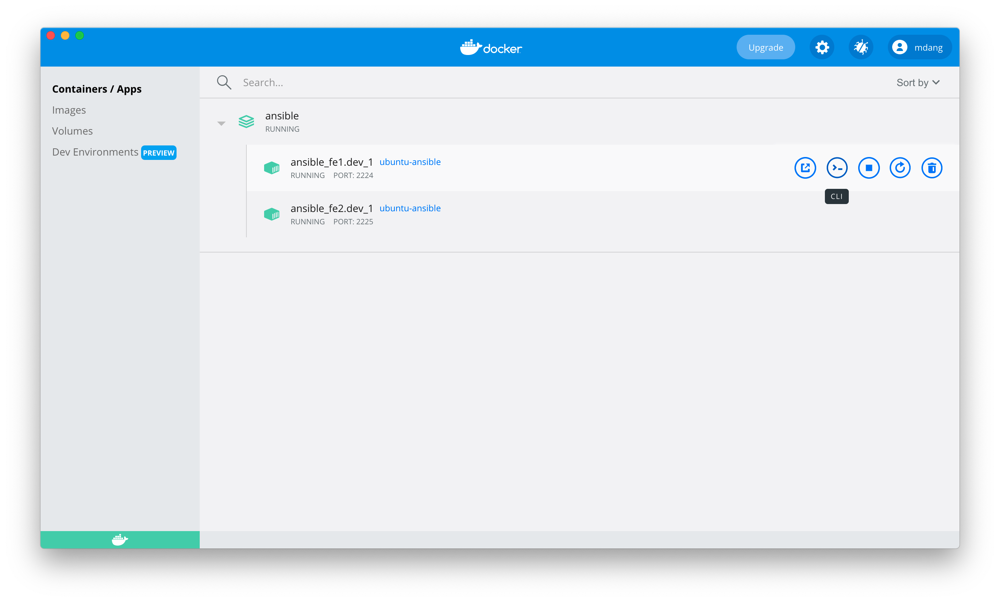
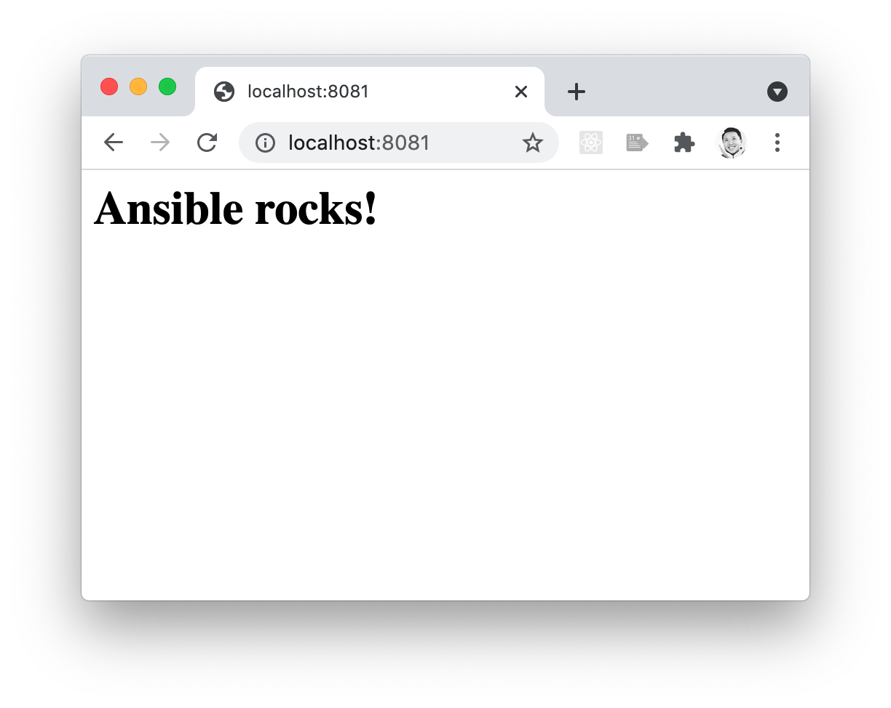

# Infrastructure as Code 

Intro to what IaC is

## Ansible

How does Ansible fit into world of IaC

## How it Works

One control machine that has Ansible installed, Ansibe is not a requirement for the servers created. 

### Ansible Playbooks

YAML based 

## Installing Ansible 

[Instructions](https://docs.ansible.com/ansible/2.5/installation_guide/intro_installation.html#latest-releases-via-pip)

```
$ sudo easy_install pip
$ sudo pip install ansible
```

## Setting up Docker

In this demo, we'll set up multiple front-end servers running Nginx using Docker containers. In case you aren't familiar, Nginx is a free, open-source and high-performance HTTP server that's popular for serving static websites. 

### Clone this repository 

Clone this repo and `cd` into it

### Enable SSH access

In order to be able to SSH into our containers we'll set up some SSH keys for this application. The following command will generate both the public (id_rsa.pub) and private part (id_rsa) of the key. 

```
$ ssh-keygen
```
**Note** When prompted to enter the filename enter `ansible_rsa` to avoid overwriting any SSH keys you might already have set up. You can also leave the passphrase empty also when prompted as this is only for demo purposes.

### Creating our Dockerfile 

A requirement of Ansible is Python, we'll also want to enable SSH as well to connect to our Docker containers. 

```Dockerfile
FROM ubuntu:latest
RUN apt-get update && \
    apt-get install -y openssh-server pwgen netcat net-tools curl wget && \
    apt-get clean all

RUN apt-get update && apt-get install -y \ 
        build-essential \ 
        python3 \ 
        python-dev \ 
        libxml2-dev \ 
        libxslt-dev \ 
        libssl-dev \ 
        zlib1g-dev \ 
        libyaml-dev \ 
        libffi-dev \ 
        python3-pip

RUN pip install --upgrade pip \ 
 virtualenv \
 requests

# Enable SSH access
RUN mkdir /var/run/sshd

RUN sed -ri 's/^PermitRootLogin\s+.*/PermitRootLogin yes/' /etc/ssh/sshd_config
RUN sed -ri 's/UsePAM yes/#UsePAM yes/g' /etc/ssh/sshd_config

RUN mkdir /root/.ssh
COPY ansible_rsa.pub /root/.ssh/authorized_keys
RUN chmod 400 /root/.ssh/authorized_keys

# Port 22 for SSH and 5000 for Flask
EXPOSE 22 5000
CMD ["/usr/sbin/sshd", "-D"]
```
 
Build our Docker image and tag it as `ubuntu-ansible` for use later 
```
$ docker build . -t ubuntu-ansible
```

### Creating docker-compose.yml file 

We will use the `ubuntu-ansible` image as the base for our front-end web servers. We'll create two servers in this example but it could easily be expaded to include many more. 

```Dockerfile
version: '2'
services:
  fe1.dev:
    image: ubuntu-ansible
    hostname: fe1.dev
    ports:
      - "2224:22"
      - "8081:80"
  fe2.dev:
    image: ubuntu-ansible
    hostname: fe2.dev
    ports:
      - "2225:22"
      - "8082:80"
```

Now let's start our Docker containers: 

```
$ docker-compose up -d
```


If you open Docker Desktop, you should see the following two containers running. 



## Setting up Ansible

### Inventory file

TBD what is it used for 

```inventory
[frontend]
fe1.dev
fe2.dev
```

### ssh.config

If not present, Ansible will use the globah ssh configuration on your machine. 

```
Host *
    #disable host key checking: avoid asking for the keyprint authenticity
    StrictHostKeyChecking no
    UserKnownHostsFile /dev/null
    #enable hashing known_host file
    HashKnownHosts yes
    #IdentityFile allows to specify exactly which private key I wish to use for authentification
    IdentityFile ./ansible_rsa

Host fe1.dev
    HostName localhost
    User root
    Port 2224
Host fe2.dev
    HostName localhost
    User root
    Port 2225
```

### ansible.cfg

The Ansible configuration file 

```
[defaults]
# Default location of the inventory file that Ansible will use to determine what hosts it can talk to
inventory = inventory

# Specify here the remote hosts so we do not need to configure them in main ssh config
[ssh_connection]
transport = ssh
ssh_args = -F ssh.config
```

### Test the configuration 

Test the servers with the following command in the terminal: 
```
$ ansible all -m ping
```

You should get a response similar to the following 
```
fe1.dev | SUCCESS => {
    "changed": false, 
    "ping": "pong"
}
fe2.dev | SUCCESS => {
    "changed": false, 
    "ping": "pong"
}
```

## Creating the Ansible Playbook 

We will now create a new file called **site.yml**

```
- hosts: frontend
  remote_user: root
  become: yes

  tasks:
    - name: install the latest version of Nginx
      apt: name=nginx state=latest
    - name: copy the HTML page to the server
      template:
        src: ./frontend/index.html
        dest: /var/www/html/index.html
    - name: start nginx
      service:
        name: nginx
        state: started
```

### Run the playbook 

```
$ ansible-playbook site.yml
```



### Confirming the changes 

Go back to Docker Desktop and hover over one of the front-end servers. Click on the second button for the CLI



Now `cd` into the destination directory specified in our playbook: `/var/www/html`. We should see the index.html file copied over for this and the other front-end server. 

```
$ cd /var/www/html/
$ ls
$ cat index.html
```

Now if you remember in our docker-compose.yml file, we mapped the ports from our containers to our machine, specifically ports `8081` and `8082`. 

Let's access these url's in our browser, you should see we have two front-end websites now served by Nginx! 




How cool is that??

## You Do: Add a Back-end Flask Server

With a few changes, we will be able to add a Python API using Flask! 

Update **docker-compose.yml** to include the web server. Flask runs by default on port 5000, we'll map that port on the container to port `8083` on our machine. We'll be using the same base image from before since it already has support for Python. 

```Docker
version: '2'
services:
  fe1.dev:
    image: ubuntu-ansible
    hostname: fe1.dev
    ports:
      - "2224:22"
      - "8081:80"
  fe2.dev:
    image: ubuntu-ansible
    hostname: fe2.dev
    ports:
      - "2225:22"
      - "8082:80"
  be1.dev:
    image: ubuntu-ansible
    hostname: be1.dev
    ports:
      - "2226:22"
      - "8083:5000"
```

Now run the compose file to bring up our backend container. 

```
$ docker-compose up -d
```

Update the **inventory** file to include the back-end server

```
[frontend]
fe1.dev
fe2.dev

[frontend:vars]
ansible_python_interpreter=/usr/bin/python3

[backend]
be1.dev

[backend:vars]
ansible_python_interpreter=/usr/bin/python3
```

Update the ssh.config file 

```
Host *
    #disable host key checking: avoid asking for the keyprint authenticity
    StrictHostKeyChecking no
    UserKnownHostsFile /dev/null
    #enable hashing known_host file
    HashKnownHosts yes
    #IdentityFile allows to specify exactly which private key I wish to use for authentification
    IdentityFile ./ansible_rsa

Host fe1.dev
    HostName localhost
    User root
    Port 2224
Host fe2.dev
    HostName localhost
    User root
    Port 2225
Host be1.dev
    HostName localhost
    User root
    Port 2226
```

Modify the Ansible playbook to include tasks for installing Flask on the backend server and copying the modified HTML file that makes an AJAX request. 

```
- hosts: frontend
  remote_user: root
  become: yes

  tasks:
    - name: install the latest version of Nginx
      apt: name=nginx state=latest
    - name: copy the HTML page to the server
      template:
        src: ./frontend/ajax.html
        dest: /var/www/html/index.html
    - name: start nginx
      service:
        name: nginx
        state: started

- hosts: backend
  remote_user: root
  become: yes

  tasks:
    - name: install Flask
      pip: name=flask
    - name: install flask_cors
      become: true
      pip:
        name: flask_cors
        state: present
    - name: copy the app to new server 
      template:
        src: ./backend/app.py
        dest: /var/opt/app.py
    - name: start Flask
      shell: "FLASK_APP=/var/opt/app.py flask run --host=0.0.0.0"
```

Run the playbook again

```
$ ansible-playbook site.yml
```

Finally, let's test our frontend websites again to make sure they're now pulling data from our Flask API (http://localhost:8083/courses) by going to:
- http://localhost:8081
- http://localhost:8082


